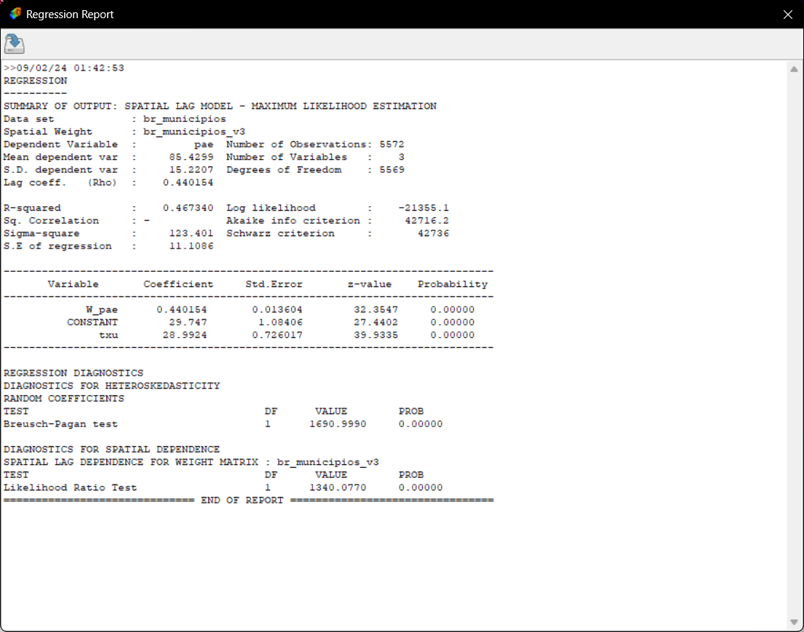
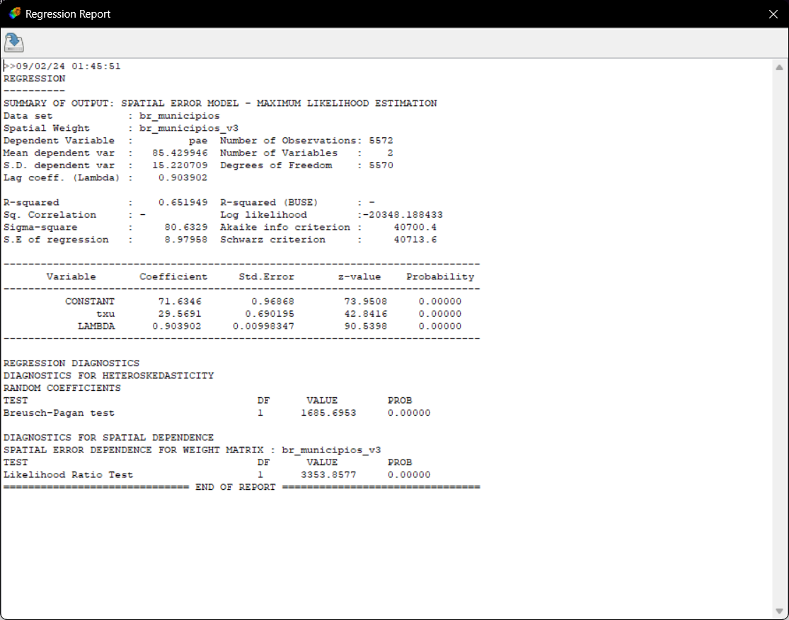
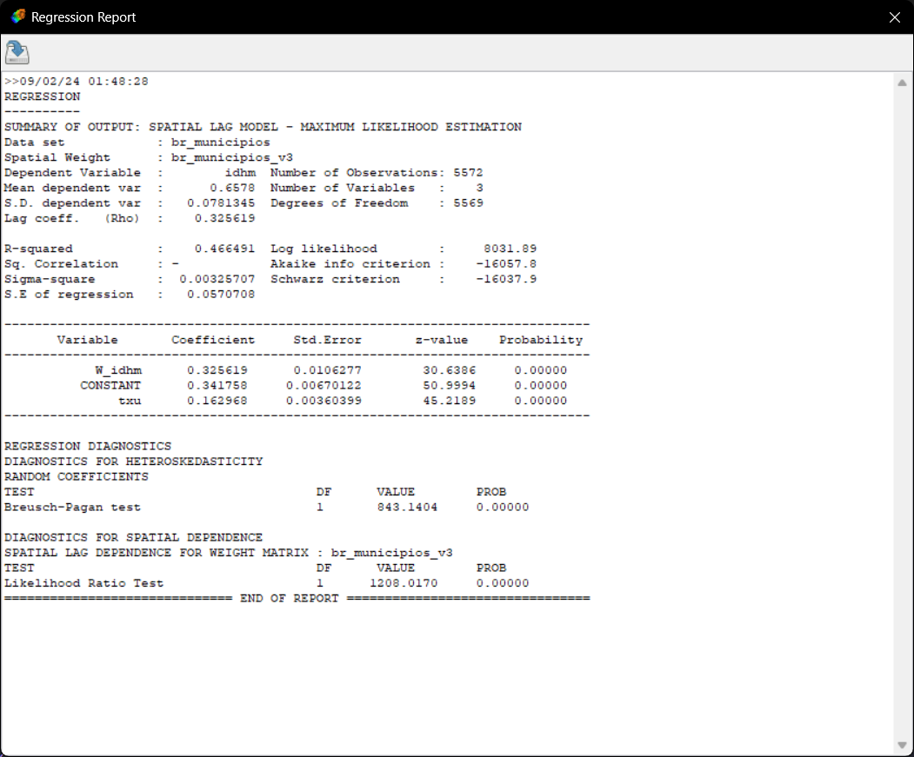
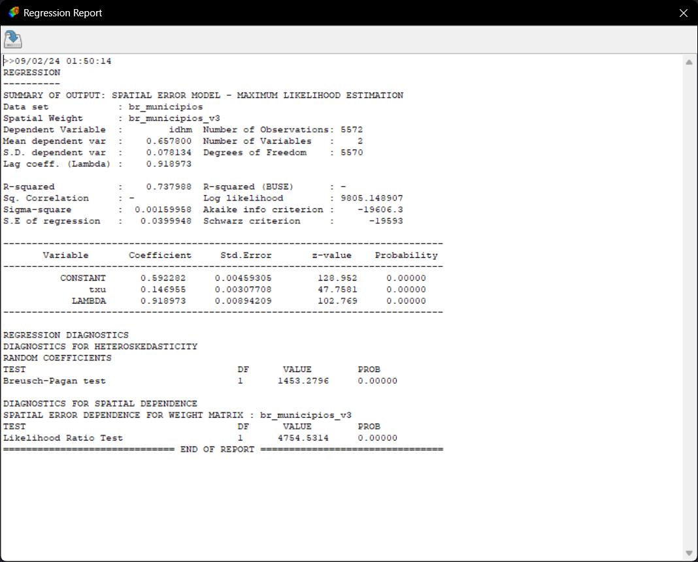

### Instalando Bibliotecas

Neste roteiro, vamos usar os seguintes pacotes:

-   `tidyverse`: para adicionar o operador `%>%` e a função `mutate()`

-   `sf`: para abrir e manipular dados geoespaciais (shapefile ou geopackage)

-   `spdep`: para calcular a autorrelação espacial e a matriz de pesos espaciais

-   `spatialreg`: para calcular os modelos de regressão espacial global

-   `spgrw`: para calcular o modelo de regressão espacial local

Se você ainda não possui esses pacotes instalados, é necessário executar o comando abaixo para instalar.

```{r}

rm(list = ls())

packages = c(
  "Rcpp",
  "tidyverse",
  "sf",
  "spdep",
  "spatialreg",
  "spgwr"
)

for (package in packages){
  if (!(package %in% installed.packages())) {
    install.packages(package)
  }
}

library(tidyverse)
library(sf)
library(spdep)
library(spatialreg)
library(spgwr)

```

### Importando Dados

A base de dados está em formato geopackage (.gpkg) e pode ser importada com a função `read_sf()`.

Nesta etapa, temos os dados gerados na versão 02 do projeto, além dos índices de Moran calculados no software GeoDa. Além disso, serão feitas algumas transformações, levando em consideração que:

1.  O modelo não vai funcionar em uma base de dados com valores faltantes (NA).

2.  É necessário trazer em uma coluna as coordenadas do centróide dos polígonos (longitude/latitude).

3.  Os modelos de regressão espacial são complexos e exigem um tempo de processamento muito maior que os modelos lineares! Nos nossos testes, o tempo de processamento variou entre 10 a 30 minutos. Recomenda-se rodar o modelo apenas em uma amostra dos dados.

```{r}

# dados2010 = read_sf("../dados/br_municipios_V2.gpkg")
# 
# dados2010 = dados2010 %>%
#   filter(!is.na(TXU) & !is.na(PAE) & !is.na(IDHM))
# 
# dados2010 = dados2010 %>%
#   mutate(LON = st_coordinates(st_centroid(dados2010))[,1],
#          LAT = st_coordinates(st_centroid(dados2010))[,2])
# 
# write_sf(dados2010, "../dados/br_municipios_V3.gpkg")
```

Para fins de processamento, o código anterior foi comentado e os dados necessários foram importados do arquivo que foi gerado. Lembre-se, se é a primeira vez que você roda esse scrip, não se esqueça de descomentar o trecho anterior.

```{r}

dados2010 = read_sf("../dados/br_municipios_V3.gpkg")

View(dados2010)
```

### Modelos de regressão espacial global (Spatial Lag e Spatial Error)

Após a análise espacial dos resíduos - que permitiu observar que as observações não são independentes espacialmente, vamos incorportar a estrutura de dependência espacial no modelo.

Os modelos globais incluem no modelo de regressão um parâmetro para capturar a estrutura de autocorrelação espacial na área de estudo como um todo.

O Spatial Lag (SAR) atribue a autocorrelação espacial à variável resposta Y (lag), enquanto o Spatial Error (CAR) atribue a autocorrelação espacial ao erro.

O ponto de partida para o Spatial Lag e Spatial Error é o modelo de regressão linear (Roteiro 5), criado com a função `lm()`. Também é necessário criar um arquivo com a lista de vizinhança, com a função `poly2nb()`. Foi usado o critério de vizinhança do tipo `queen`. Para usar outros critérios, lembre-se de consultar a documentação da função.

Agora é possível criar uma matriz de pesos espaciais, com as funções `nb2mat()`e `mat2listw()`. Em vários momentos é necessário definir o argumento adicional `zero.policy = TRUE`, que permite obter os resultados mesmo que uma ou mais observações não tenham nenhum vizinho. Não se esqueça de adicionar este parâmetro sempre que indicado neste roteiro.

Pro fim, já é possível realizar o teste de autocorrelação espacial dos resíduos, com a função lm.morantest(), que levará como argumentos: o modelo (modelo1), a matriz de pesos espaciais (rwm) e a tipo de hipótese alternativa (“two-sided”, que representa o teste bicaudal).

De acordo com o resultado do teste pode-se determinar se há dependência espacial nos resíduos e um modelo de regressão espacial global pode ser aplicado.

Mas antes disso serão aplicados quatro testes de hipótese para identificar qual é o modelo mais adequado (Spatial Lag ou Spatial Error):

-   LMerr: teste LM simples para dependência do erro

-   LMlag: teste LM simples para uma variável dependente espacialmente defasada

-   RLMerr: teste LM robusto para dependência do erro

-   RLMlag: teste LM robusto para uma variável dependente espacialmente defasada

#### PAE

```{r}

modeloSimplesPAE = lm(
  formula = PAE ~ TXU, 
  data = dados2010, 
  na.action = na.exclude
)

listaVizinhancaPAE = poly2nb(
  pl = dados2010, 
  row.names = dados2010$CD_GEOCMU
)

matrizPesosEspaciaisPAE = nb2mat(
  neighbours = listaVizinhancaPAE, 
  style='B', 
  zero.policy = TRUE
)

listaPesosEspaciaisPAE <- mat2listw(
  x = matrizPesosEspaciaisPAE, 
  style='W'
)
```

##### Spatial Lag



##### Spatial Error



##### Modelo de regressão espacial local (GWR)

O modelo de regressão espacial local ou Geographically Weighted Regression (GWR) incorpora a estrutura de dependência espacial (verificada com o teste de autocorrelação espacial - Roteiro 6).

Nesse modelo, as variações espaciais são modeladas de forma contínua, com parâmetros variando no espaço. Ele ajusta um modelo de regressão para cada observação, ponderando todas as demais observações como função da distância a este ponto. Existe uma função (kernel) sobre cada ponto do espaço que determina todos os pontos da regressão local que é ponderada pela distância. Pontos mais próximos do ponto central tem maior peso. Assim como no kernel, a escolha da largura da banda é importante, pondendo ser fixa ou adaptável à densidade dos dados.

O processo de modelagem envolverá quatro etapas: (1) estimativa do kernel, (2) cômputo do modelo, (3) análise do sumário do modelo e (4) exportação dos resultados para análise espacial no QGIS.

É possível obter a melhor estimativa do kernel com a função `gwr.sel()`. Como argumentos, indicamos a fórmula, os dados, as coordenadas dos centróides e indicamos que a largura da banda será adaptativa (`adapt = TRUE`).

#### IDHM

```{r}

modeloSimplesIDHM <- lm(
  formula = IDHM ~ TXU, 
  data = dados2010, 
  na.action = na.exclude
)

listaVizinhancaIDHM = poly2nb(
  pl = dados2010, 
  row.names = dados2010$CD_GEOCMU
)

matrizPesosEspaciaisIDHM = nb2mat(
  neighbours = listaVizinhancaIDHM, 
  style='B', 
  zero.policy = TRUE
)

listaPesosEspaciaisIDHM <- mat2listw(
  x = matrizPesosEspaciaisIDHM, 
  style='W'
)

```

##### Spatial Lag



##### Spatial Error



##### Modelo de regressão espacial local (GWR)

O modelo de regressão espacial local ou Geographically Weighted Regression (GWR) incorpora a estrutura de dependência espacial (verificada com o teste de autocorrelação espacial - Roteiro 6).

Nesse modelo, as variações espaciais são modeladas de forma contínua, com parâmetros variando no espaço. Ele ajusta um modelo de regressão para cada observação, ponderando todas as demais observações como função da distância a este ponto. Existe uma função (kernel) sobre cada ponto do espaço que determina todos os pontos da regressão local que é ponderada pela distância. Pontos mais próximos do ponto central tem maior peso. Assim como no kernel, a escolha da largura da banda é importante, pondendo ser fixa ou adaptável à densidade dos dados.

O processo de modelagem envolverá quatro etapas: (1) estimativa do kernel, (2) cômputo do modelo, (3) análise do sumário do modelo e (4) exportação dos resultados para análise espacial no QGIS.

É possível obter a melhor estimativa do kernel com a função `gwr.sel()`. Como argumentos, indicamos a fórmula, os dados, as coordenadas dos centróides e indicamos que a largura da banda será adaptativa (`adapt = TRUE`).
